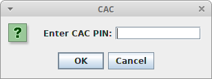
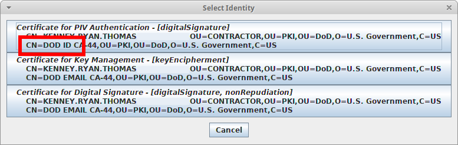

Using cac-ssl-relay
================

Overview
----------------

The process of using "cac-ssl-relay" generally involes to termainals:

1. (**Terminal 1**): Launch "cac-ssl-relay"
2. (**Termianl 2**): Make a request that will be routed through "cac-ssl-relay"
3. (**Terminal 1, or popup**): Enter smart card PIN and select cert
	* See "cac-ssl-relay" terminal for any errors.
4. (**Terminal 2**): Finish login to whatever service you're interacting with

Launching cac-ssl-relay
----------------

The installer script will make the following commands available (among many others):

* On Linux: `~/bin/cac-ssl-relay.profile-opensc`
* On Windows: `%HomePath%\bin\cac-ssl-relay.profile-windows.bat`

Simply launch the appropriate command in a terminal and leave it running.
If you ever encounter errors--due to card re-inserts or other failures--simply
restart this process and it should resume it's function.

Making Requests Through cac-ssl-relay
----------------

On startup, "cac-ssl-relay" should output something similar to the following
(with port numbers that are likely different):

	entry: nexus.moesol.com.cacrelay:9092=nexus.moesol.com:443
	entry: certs.moesol.com.cacrelay:9092=certs.moesol.com:443
	entry: gitlab.moesol.com.cacrelay:9092=gitlab.moesol.com:443
	entry: rite.sd.spawar.navy.mil.cacrelay:9092=rite.sd.spawar.navy.mil:443
	entry: bitbucket.di2e.net.cacrelay:9092=bitbucket.di2e.net:443

This means that you can interact with the CAC-protected endpoint
`rite.sd.spawar.navy.mil:443` by using `rite.sd.spawar.navy.mil.cacrelay:9092`,
so long as the "cac-ssl-relay" is running and your smart card is inserted.
(Always check the "cac-ssl-relay" terminal for errors if things aren't working.)

For example, we can use a non-smart-card-aware verson of git (most versions),
to clone a git repo:

	git clone http://rite.sd.spawar.navy.mil.cacrelay:9092/bitbucket/scm/dcgsn/dcgsn-cac-agent.git

... or use this simpler command as a test (doens't affect any local files):
	
	git ls-remote http://rite.sd.spawar.navy.mil.cacrelay:9092/bitbucket/scm/dcgsn/dcgsn-cac-agent.git

Note that the git command will hang, waiting for you to complete the next sections.

Entering PIN and Selecting Cert
----------------

When you initial a connection through "cac-ssl-relay", it will prompt for your
smart card PIN:

Once you enter your PIN, it will prompt you to select a cert.
For most services, you'll want to select your `DOD ID` cert:

If any of this fails, check for logs in the "cac-ssl-relay" terminal,
or simply restart the "cac-ssl-relay" process.

Finishing Login to Target Service
----------------

After you've selected your smart card cert, you'll have may have to finish logging
into the target service (for instance git). Do this from the terminal/program
that initiated the action.

In the case of Git/RITE, you'll need to provide your RITE credentials.

